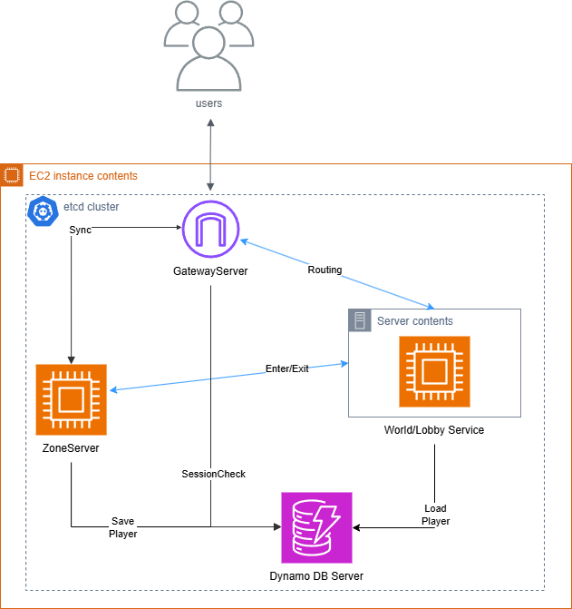
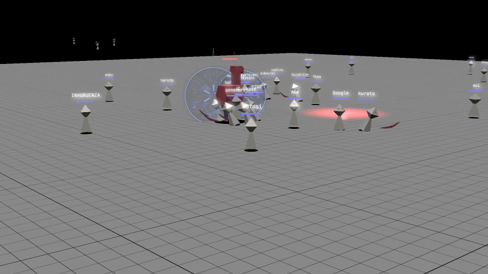
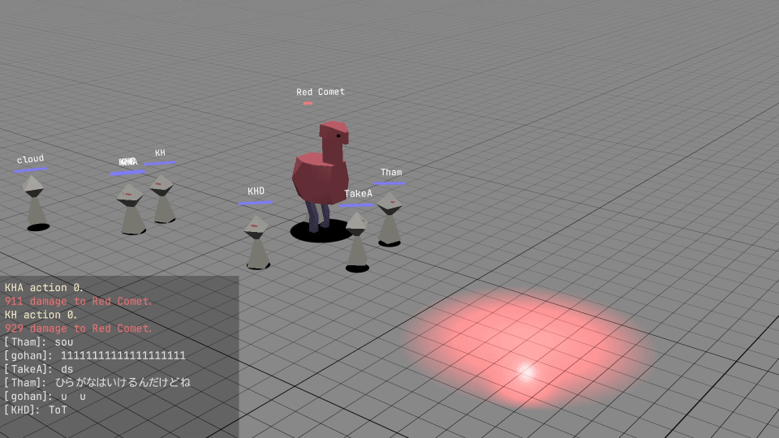

# Multiplayer Action Game

The project combines a C++ game client and a Rust-based distributed real-time server stack.

## Quick View

- Architecture: `Distributed Server Architecture (Gateway, World, Zone, DB)`
- Runtime model: `Tokio async TCP` + 20 tick/s
- Protocol: `Protocol Buffers` shared across C++ client and Rust server

## Slide

Scan the QR code below to view the portfolio slide:


## Architecture Overview



The server infrastructure has been redesigned into a scalable distributed architecture:
- **Gateway Server (`portfolio-server-gateway`)**: Handles client connections and routes packets.
- **World Server (`portfolio-server-world`)**: Manages global state, and player routing.
- **Zone Server (`portfolio-server-zone`)**: Handles real-time gameplay simulation, synchronization, and state replication.
- **DB Server (`portfolio-server-db`)**: Manages persistent storage and database interactions.

## Demo

### 30-Player Test Snapshot



### In-Game Chat Traffic Snapshot



## Operational Evidence (from Server Logs)

The following section summarizes results derived from collected server logs.

### Unified Run Analysis Table

This table combines the latest two sessions and the historical high-traffic session using the same metrics.

| Session Label | Session Date (UTC) | Scope | Accepted | Estimated Max Concurrent | WARN | ERROR | Last Tick | Runtime (hours) |
|---|---|---|---:|---:|---:|---:|---:|---:|
| `Long-Run Stability Session` | `2026-01-09` | Latest | 18 | 3 | 0 | 825 | 470,804 | 6.54 |
| `Short Validation Session` | `2026-01-09` | Latest | 2 | 2 | 0 | 102 | 55,159 | 0.77 |
| `High-Traffic Historical Session` | `2025-12-09` | Historical | 64 | 34 | 6 | 2,390 | 191,597 | 2.66 |

Latest-two combined snapshot:
- Total accepted TCP connections: `20`
- Estimated max concurrent connections: `3`
- WARN entries: `0`

Concurrency estimation method:
- Estimated from log event order using `Accepted connection` as `+1` and disconnection events as `-1`.
- This is a log-derived estimate, not an authoritative server-side online-count metric.

### Error Interpretation (Log-Based)

- `Failed to send messages: Kind(WouldBlock)` : Likely cause is that when the peer side is force-terminated, send attempts repeatedly fail and surface as `WouldBlock` in this log context.
- `ConnectionReset` / `BrokenPipe` : Likely cause is that the peer disconnected or was force-closed while the server was still reading/writing on the same TCP stream.
- `Too many errors, closing connection` : Likely cause is that a defensive threshold in the connection loop is reached after repeated I/O failures, so the session is closed to protect server stability.

These are hypotheses based on logs and are used to guide improvements in backpressure handling and connection lifecycle management.

Historical note:
- The `High-Traffic Historical Session` row demonstrates a run with `64` accepted connections and an estimated peak concurrency of `34`.

## What This Repository Contains

- `PortfolioGameClient/`: Windows client (`C++20`, DirectX12, `SyzygyEngine`)
- `PortfolioGameServer/`: Rust server workspace containing Gateway, World, Zone, and DB services.
- `portfolio-proto/`: shared `.proto` schemas and local `protoc`
- `ApplyProto.ps1`: protocol generation script for client and server outputs

## Server Engineering Highlights (Rust)

### 1. Distributed Microservice Architecture via gRPC / TCP
- The backend is split into specialized nodes (Gateway, World, Zone, DB) communicating via predefined protocols.

### 2. Async connection handling on Tokio TCP

- Servers run in async mode to handle thousands of concurrent connections efficiently.
- Example: Zone server binds on its configured port to interact with Gateway/Clients.

### 3. Fixed-tick simulation loop for game updates

- Zone server tick interval is configured at `50ms`.
- Per-tick flow includes: receive, accept, process commands, update state, sync transforms, send.

### 4. Entity synchronization with server timestamps

- Broadcasts transform sync packets with microsecond timestamps.
- Excludes self-echo when distributing updates.

### 5. Cross-language protocol workflow (C++ <-> Rust)

- Shared protobuf schema is generated into both C++ and Rust projects.
- `PortfolioGameClient` automatically references generated headers.
- Rust microservices include generated `.rs` files seamlessly.
- Script reference: `ApplyProto.ps1`

## Tech Stack

- Server: Rust, Tokio, Futures, Protobuf, Chrono, Simplelog
- Client: C++20, DirectX12, Asio, ImGui, Assimp
- Tooling: Visual Studio 2022, Cargo, PowerShell, MSBuild
- Platform: Windows x64

## Clone

Use recursive clone because this repository contains submodules.

```bash
git clone --recurse-submodules https://github.com/TaiseiHamaya/PortfolioMain
cd PortfolioMain
```

If you already cloned without submodules:

```bash
git submodule update --init --recursive
```

If your environment uses Git LFS for large assets, run:

```bash
git lfs pull
```

## Build and Run

Server side is split into multiple Rust binaries. Run the service you want to verify from its own folder.

### 1. Build or run Rust services

Start each service in its own terminal:

- DB

```powershell
cd PortfolioGameServer/portfolio-server-db
cargo run
```

- World

```powershell
cd PortfolioGameServer/portfolio-server-world
cargo run
```

- Gateway

```powershell
cd PortfolioGameServer/portfolio-server-gateway
cargo run
```

- Zone

```powershell
cd PortfolioGameServer/portfolio-server-zone
cargo run
```

Default ports used by the current implementation:
- DB: `50050`
- World: `50051`
- Lobby: `50052`
- Gateway: `50054`
- Zone / client listener: `3215`

Note:
- The distributed backend depends on `etcd`, AWS/DynamoDB settings, and the shared `.env` values used by each service.
- Some services share the same default port range, so if you run them on the same machine, adjust the environment settings as needed.

### 2. Build Client (Visual Studio)

1. Open `PortfolioGameClient/Portfolio.sln`
2. Select `Debug|x64`, `Develop|x64`, or `Release|x64`
3. Build solution

Expected executable output:
- `generated/outputs/x64/<Configuration>/Portfolio.exe`

### 3. Regenerate Protocol Code (Optional)

```powershell
pwsh ./ApplyProto.ps1
```

## Repository Layout

```text
PortfolioMain/
|- PortfolioGameClient/
|- PortfolioGameServer/
|- proto/
|- docs/media/
|- ApplyProto.ps1
`- README.md
```

## Notes on gitignored / Local Test Folders

Some folders are intentionally excluded because they are generated artifacts or local test/runtime data.

Verified examples:
- `/generated`
- `PortfolioGameClient/Game/DevTool/temp/*`
- `PortfolioGameClient/SyzygyEngine/Log/*`
- `PortfolioGameServer/**/target`
- `PortfolioGameServer/PortfolioServerZone/log`

These are required for local development/testing but are not part of tracked source files.
